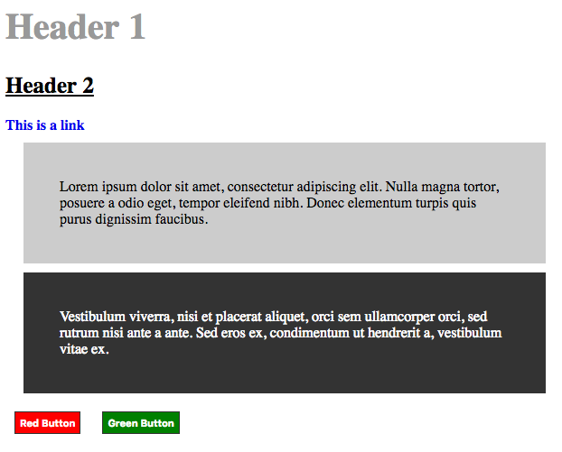
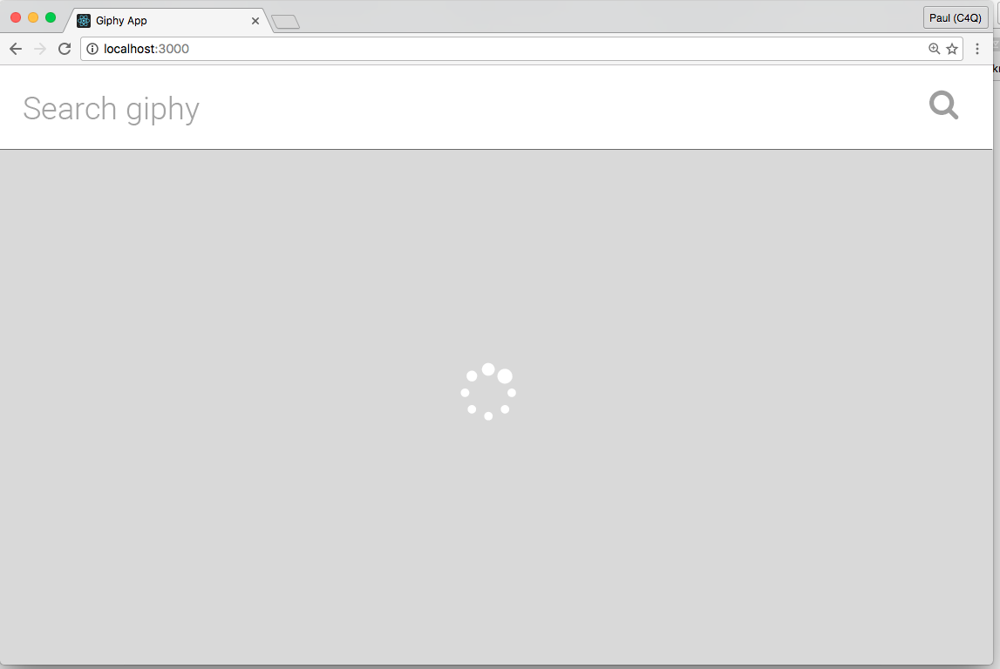
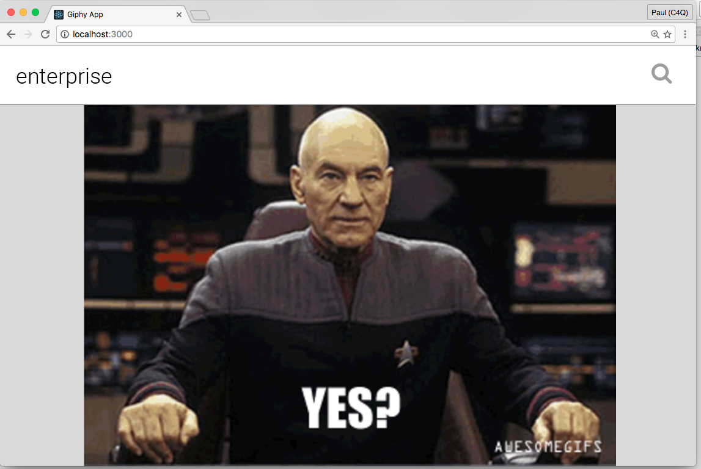
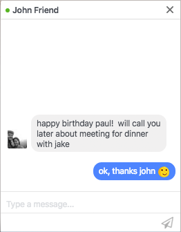

# Advanced CSS (flexbox)
- make your apps look professional and have good UX
- tags: CSS, React, Flexbox, Responsive

# Objectives
- Apply a stylesheet to your React app
- Use flexbox to layout elements in your app
- Use a glyph font to style buttons and add icons

# Resouces
- [Flexbox introduction](https://css-tricks.com/snippets/css/a-guide-to-flexbox/)
- [Material Design forms examples](https://www.muicss.com/docs/v1/css-js/forms)
  This is a library that will style your forms to meet the Google Material Design spec. It’s a good example of giving your forms a consistent look and feel.
- [Flexbox demo tool](https://github.com/pzhine/flexboxdemo)
  Clone this repo and follow the readme to build and run the demo. Experiment with different layouts.
- [Flexbox cheatsheet](http://apps.workflower.fi/css-cheats/?name=flexbox)
- Glyph font libraries
  - [FontAwesome](http://fontawesome.io/icons/)
  - [Zurb](http://zurb.com/playground/foundation-icon-fonts-3)
  - [IonIcons](http://ionicons.com/)

# Warmup/Review Exercise
Write CSS for [this html](warmup.html) so that it looks like this in the browser:  


# Lecture

## Webpack and CSS
Start with a new clone of the [simple react setup](https://github.com/nmadd/simple-react-setup). Then run:
```
npm install
npm install --save-dev css-loader style-loader
```
Add the following line to your App.js file:
```javascript
var css = require("./App.css");
```
Now clear out App.css and add the following line:
```css
h1 {
  color: red;
}
```
Run `npm start` and your "Hello world" header should be red!

## Webpack and Glyph fonts
The [Get Started](http://fontawesome.io/get-started/) directions for FontAwesome work in our webpack project. You can use this CDN script tag in your index.html:
```html
<head>
  ...
  <script src="https://use.fontawesome.com/2af5f3d917.js"></script>
</head>
```
Now we can use any of the [FontAwesome icons](http://fontawesome.io/icons/) in our app. Try the following in your App.js. Note that we have to use `className`, not just `class` for this to work:
```html
<div>
  <h1>Hello World!</h1>
  <i className="fa fa-camera-retro"></i> fa-camera-retro
</div>
```

## Exercise 1: Style your giphy App
 

## Exercise 2: Chat Widget App
We're buiding a chat widget similar to the one on Facebook

### Step 1: Diagram our boxes

- define the name and boundaries for each box element
- Link to [CSS diagraming Google Drawing](https://docs.google.com/drawings/d/1u2aHIdqPMURSsZKUHA0tBlovr9fVyex0WUGC682Bybg/edit?usp=sharing)

### Step 2: Write our HTML
- Use your CSS diagram to structure your HTML
- Add "placeholder" or "lorem ipsum" content to help you layout your elements

### Step 3: Write our CSS
- Use your CSS diagram to guide your code
- Use the [Flexbox demo tool](https://github.com/pzhine/flexboxdemo) or [Flexbox cheatsheet](http://apps.workflower.fi/css-cheats/?name=flexbox) to help with syntax
- Style one "level" at a time

### Step 4: Diagram our React components
- Define the names and properties for our components
- Link to [CSS diagraming Google Drawing](https://docs.google.com/drawings/d/1u2aHIdqPMURSsZKUHA0tBlovr9fVyex0WUGC682Bybg/edit?usp=sharing)

### Step 5: Build our React components
- Start at the "lowest level" (last frame in our diagram) and work up